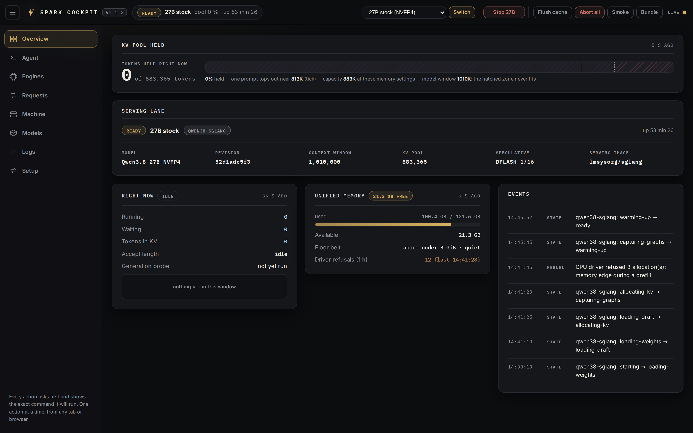

# Qwen3.8 on DGX Spark (GB10): 27B at 71 tok/s, Flash-Next 176B on one box

One command installs a boot-persistent, hardened serving stack for the Qwen3.8 family on a single DGX Spark, with **seven switchable targets** and **zero quality loss** on each (NVFP4 is the quantization floor, Qwen's own FP8 is available above it; every speculative path is lossless by construction). Since v1.8 the flash lane serves an **official SGLang image** for this hardware with nothing added, serves **4 concurrent requests** where it used to serve one, and got **14 to 25% of its decode back from one flag** (`--speculative-token-map`, see below):

| target | model | engine | headline (measured here) |
|---|---|---|---|
| `stock` (default) | Qwen3.8-27B NVFP4 | SGLang + DFlash2 | **71.4 tok/s** greedy median, 135-148 aggregate at 8 streams, optional 1M context |
| `uncensored` | Qwen3.8-27B abliterated NVFP4 | SGLang + DFlash2 | same speed and serving path as stock |
| `fp8` | Qwen3.8-27B FP8, Qwen's own release | SGLang + DFlash2 | the quantization reference: 108 tok/s aggregate at 8 streams, ~92K less KV pool |
| `uncensored-fp8` | Qwen3.8-27B abliterated FP8 | SGLang + DFlash2 | same serving path and same cost as `fp8` |
| `flash` (default of its lane) | **Qwen3.8-Flash-Next 176B** hybrid MoE NVFP4 | SGLang + NEXTN | **47.9 tok/s on code, 47.1 on math, 29-31 on prose, 27.0 ms/tok on an agent loop, prefix caching, vision**, 262K on ONE box |
| `flash-uncensored` | the **abliterated** build of that same tree | SGLang + NEXTN | 205 of 206 shards identical in size to stock, so the same flags: 45-46 on code, **0 refusals of 5** |
| `flash-nvda` | the same 176B from NVIDIA's mixed-precision export | SGLang + NEXTN | same N-gram table byte for byte, its own expert calibration: ties `flash` on every quality probe, with a KV pool about 9% smaller |

The 27B path is the fastest configuration measured so far on GB10 (**SGLang + NVFP4 + DFlash2 speculative decoding with deterministic kernels, drafting from a calibrated NVFP4 head 16 deep**): **71.4 tok/s greedy median on `./bench.sh`**, measured 2026-09-17 when this lane moved to the official release image, against 69.8 on the image it replaced and 65.3 on the v1.9 campaign before it (per probe then: code 64.2-65.3, reasoning 65.3-66.2, math 56.6-71.3, prose 23.0-24.7). Free prose is the slow case on any drafter. **135-148 tok/s aggregate at 8 concurrent streams, 258 at 32** (carried over from the v1.2 battery; the draft only helps concurrency, re-measure on your box with `./bench-matrix.sh`). Reproducible to the decimal across boots: see BENCHMARKS.md, "The boot lottery".

The flash path serves a model that does not otherwise fit: the 176B checkpoint's 47.7 GiB FP8 N-gram table is **served from a sparse file on NVMe**, read row by row by the gather kernel through GB10's host page tables, leaving the unified pool to the compute weights and a real KV cache. Until v1.7 that was a vendored patch of this repo's own; since v1.8 it is upstream (`--ple-offload-backend file`, [sglang#37068](https://github.com/sgl-project/sglang/pull/37068)) and the overlay is retired, along with the vendored sm_121 QSA kernel and the workaround for the GB10 MTP collapse. **Prefix caching works** (27k tokens re-served in 2.5 s against 12.0 s cold), decode is **47.9 tok/s on code and 47.1 on math** single stream (29-31 on prose), prefill ~2,250 tok/s cold, and image input stays available. Since v1.8 it also takes **`--speculative-token-map`**, which hands the speculative draft the target's `lm_head` sliced to 65,536 rows instead of all 248,320: that removes 2.6 GiB from every engine step on a lane that is memory-bandwidth bound, and it is worth 14 to 25% of decode without changing what the model can say, because the target still verifies every drafted token over the whole vocabulary.

Whatever the target, you get the same surface: an **OpenAI-compatible API** on port 30000 (both lanes also speak the Anthropic protocol), a keepalive proxy for agent CLIs on 30001, and **[opencode](https://opencode.ai) works out of the box** (the installer writes a ready-to-use provider config; the chat template ships pre-patched for agentic clients). The stack is built to grow: more targets, engines and drafters will slot into the same switch surface.

## Where everything is

The README is the entry point. Everything longer lives next to it, one subject per file.

| If you want | Read |
|---|---|
| Every number this repo publishes, how it was measured, and the failed experiments | [BENCHMARKS.md](BENCHMARKS.md) |
| The 1M context mode: what it serves, what it costs, how limits are fitted to your boot | [docs/context-1m.md](docs/context-1m.md) |
| The flash lane in full: how a 176B fits, the three tiers, what each one measured | [docs/flash-lane.md](docs/flash-lane.md) |
| The cockpit, tab by tab, including the Agent tab and how it behaves on a phone | [docs/cockpit.md](docs/cockpit.md) |
| Day-to-day commands, the opt-in extras, upgrading from an earlier version | [docs/operations.md](docs/operations.md) |
| What the installer writes for opencode, and how to opt out | [docs/opencode.md](docs/opencode.md) |
| Clients: Claude Code, VS Code Copilot, Open WebUI, Cursor, TLS, per-client identity | [docs/clients.md](docs/clients.md) |
| Why `--mem-fraction-static` decides whether this box stays alive | [docs/gb10-memory.md](docs/gb10-memory.md) |
| Where each lane stands against upstream SGLang, re-checked in the images | [docs/upstream.md](docs/upstream.md) |
| Typed decisions in full: the contract, the four levers, the refusals, the load | [docs/systemone.md](docs/systemone.md) |
| The `lean` reasoning level: method, numbers, negative results | [LEAN.md](LEAN.md) |
| What changed in every release, with the measurement behind each change | [CHANGELOG.md](CHANGELOG.md) |
| The layout, the state files, the invariants CI holds | [ARCHITECTURE.md](ARCHITECTURE.md) |
| How this repo is tested, and what the tests found in code already in production | [TESTING.md](TESTING.md) |
| Where this is going | [ROADMAP.md](ROADMAP.md) |
| Trust model and private reporting | [SECURITY.md](SECURITY.md) |
| To contribute | [CONTRIBUTING.md](CONTRIBUTING.md) |
| Mirroring the pinned image and checkpoints for an air-gapped install | [MIRROR.md](MIRROR.md) |
| Every capability mapped to a panel or an action, audited at v1.5 | [dashboard/CAPABILITIES.md](dashboard/CAPABILITIES.md) |
| The cockpit's design foundations | [dashboard/DESIGN.md](dashboard/DESIGN.md) |
| The cockpit as it stood at its v1.6 review, kept as history | [dashboard/REVIEW.md](dashboard/REVIEW.md) |
| Provenance and licenses of the retired flash overlay | [flash-sglang/ATTRIBUTION.md](flash-sglang/ATTRIBUTION.md) |
| Reproducing the MMLU and HumanEval numbers, and the two image quirks in the way | [evals/README.md](evals/README.md) |
| Running a GGUF model on this box instead | [extras/gguf/README.md](extras/gguf/README.md) |

## The whole stack at a glance

```
                         +-----------------------------+
  agent CLIs / SDKs ---> | keepalive proxy :30001      |  keepalives, aborts, guards
  (opencode, Claude)     +-------------+---------------+
                                       | forwards
                         +-------------v---------------+
                         | SGLang engine :30000        |  27B DFlash2 or 176B NEXTN,
                         | (one lane at a time)        |  OpenAI + Anthropic dialects
                         +-----------------------------+
  you, from a browser -->| Spark Cockpit :30090        |  health that is real, actions,
  (desk or phone)        | + Agent tab (opencode web)  |  jobs, registry, recipes, logs
                         +-----------------------------+
```

The engine answers `/health` even when it is wedged, so the cockpit runs a real generation canary and reports `ready`, `loading`, `wedged` or `stopped` from that. Everything privileged the cockpit can do (unit start/stop/restart, lane switch, flush, abort) goes through an exact-argv sudoers allowlist and is audited. The Agent tab frames opencode's own web interface behind the cockpit login, so sessions on the box run from a laptop or a phone with no terminal. Full tour: [docs/cockpit.md](docs/cockpit.md). Since v1.12 it is **installed by the one-liner like everything else**: when the installer finishes it prints the URL, and that page is where this box is meant to be driven from. `--no-cockpit` opts out, and the choice sticks.

## Quickstart

Requirements: DGX Spark or other GB10 machine (128 GB unified), stock DGX OS (Docker + NVIDIA container toolkit). Free disk, as the installer checks it before it downloads anything: for a 27B target, **45 GB** on the disk of `HF_CACHE` (`~/.cache/huggingface` by default) for the checkpoints and caches, and **40 GB** on Docker's (`/var/lib/docker`) for its 33 GB image; for a flash target, **230 GB** on the disk of `HF_CACHE` (180 for the checkpoint and its caches, 50 for the 47.7 GiB PLE table the lane rewrites at every boot, counted on the disk of `PLE_DIR` instead when that is another one) and **35 GB** on Docker's for its 30 GB image. When both are one disk, as on a stock box, the installer asks for the sum there: **85 GB** for a 27B target, **265 GB** for a flash one. What the cache already holds of a checkpoint comes off its share (a checkpoint that is all there needs 10 GB of working room instead), and an image already pulled needs 5 GB instead of its own size. Caching the other 27B targets adds ~22 GB per NVFP4 target and ~31 GB per FP8 one.

One command, first install and updates alike. It clones or updates `~/dgx-spark-qwen38`, then runs the pinned installer, which installs **the whole box**: engine, keepalive proxy, opencode wiring, the cockpit and its Agent tab. It ends by printing the cockpit URL, and there is nothing left to run by hand.

```bash
curl -fsSL https://raw.githubusercontent.com/hasso5703/dgx-spark-qwen38/main/get.sh | bash
```

**No `sudo` in front of it, ever.** The installer calls `sudo` itself, for the privileged steps and for nothing else. Under `sudo`, `$HOME` is `/root`: the clone, the API key, the chat template and the compile cache all land in `/root`, the units are rendered pointing there, and the engine then installs, starts and serves perfectly well with a key nobody has, so every client reading `~/.config/qwen38/api-key` gets 401. Both entry points refuse root before writing anything (`tests/test_install_root_refusal.py`).

Options ride on the **bash side** of the pipe (an env prefix on `curl` would not reach the installer):

```bash
curl -fsSL https://raw.githubusercontent.com/hasso5703/dgx-spark-qwen38/main/get.sh | MODEL_CHOICE=uncensored bash
curl -fsSL https://raw.githubusercontent.com/hasso5703/dgx-spark-qwen38/main/get.sh | MODEL_CHOICE=flash bash
curl -fsSL https://raw.githubusercontent.com/hasso5703/dgx-spark-qwen38/main/get.sh | CONTEXT_MODE=native bash
```

Or the explicit way:

```bash
git clone https://github.com/hasso5703/dgx-spark-qwen38.git
cd dgx-spark-qwen38
./install.sh            # image + checkpoints + systemd service, starts at every boot
./bench.sh              # verify your tok/s
```

First boot takes **~7-9 minutes** for a 27B target (CUDA graph capture + kernel compilation, cached afterwards; later boots ~5-7 min) and **~12-15 minutes** for a flash target, every boot: the server writes the whole 47.7 GiB N-gram table into its file each time (measured here: 12 min 21 s to `/health` on a fresh table). Then:

- **opencode**: ready config at `~/.config/qwen38/opencode.json`, see [opencode integration](docs/opencode.md)
- **Any OpenAI client**: `http://<host>:30001/v1/chat/completions`, model `qwen3.8-27b` (flash: `qwen3.8-flash-next`), Bearer key from `~/.config/qwen38/api-key`
- **Anthropic protocol**: `http://<host>:30001/v1/messages` (`Authorization: Bearer` only, not `x-api-key`)
- Both are the **keepalive proxy**, not the engine: it relays every route the engine serves and adds the guards for the requests SGLang dies on rather than refuses. Since v1.17 the engine itself binds `127.0.0.1` and `:30000` answers on the box only ([docs/clients.md](docs/clients.md), [SECURITY.md](SECURITY.md))
- **Don't want a systemd service?** `./install.sh --no-service && ./run.sh`: the native unit's pins and flags, foreground, no sudo, Ctrl+C and it's gone (27B targets; flash is service-only in this release). That path has no proxy: clients talk to the engine on `:30000`, without the guards, and `run.sh` serves it on `127.0.0.1` like the units (`ENGINE_BIND=0.0.0.0 ./run.sh` puts it on every interface).
- Everything is **pinned twice** (base image digest + checkpoint revisions at download, and the same `--revision` passed to the server itself, so an upstream push to a checkpoint repo can never change what you serve; plus sha256-verified overlay files for the flash lane's rollback image, `flash-sglang/ATTRIBUTION.md`). It still works months from now; the installer is idempotent and every failure path says how to fix itself. `MODEL_REV=main ./install.sh` overrides the pins; `git checkout v1.1 && ./install.sh` returns to the DSpark config.
- Since 2026-08-21 this same combination (DFLASH2, draft depth 16 since v1.9) is the **official recipe in the
  [SGLang cookbook](https://docs.sglang.io/cookbook/autoregressive/Qwen/Qwen3.8-27B)**, and since v1.14 both lanes
  serve an image this repo did not build. Where each lane stands against upstream, re-checked inside the images
  rather than against dates, and re-measured before every conclusion: **[docs/upstream.md](docs/upstream.md)**.

### Your choices, and how they combine

Everything below is optional and combinable. Variables ride on the `bash` side of the one-liner, flags go after `bash -s --`; with a clone, they go straight on `./install.sh`.

| Choice | How | Default | Notes |
|---|---|---|---|
| Model | `MODEL_CHOICE=stock`, `uncensored`, `fp8`, `uncensored-fp8`, `flash`, `flash-uncensored`, `flash-nvda` | `stock` | 27B NVFP4 stock or abliterated, the same pair in Qwen's FP8, or Flash-Next 176B in one of three NVFP4 exports (see the seven targets) |
| Reduced draft vocabulary | `SPEC_TOKEN_MAP_SIZE=65536`, or `0` to serve without it | `65536` | flash only: hands the speculative draft the target's `lm_head` sliced to that many rows, which is 14 to 25% of decode and cannot change what the model may say |
| Flash serving tier | `FLASH_TIER=context`, `concurrency`, `throughput` | `context` | flash only: 4 concurrent requests and a pool that takes a full 262K prompt, 8 requests at a third of the pool, or 24 without speculation |
| Reasoning effort | `lean` (default), `xhigh`, `medium`, `low` | **`lean`** | the level this repo adds and defaults to: 74 words in the chat template that cost 0.71x the thinking tokens of `medium` on 364 public problems and 0.436x on 58 underspecified requests, with no measured quality cost. Qwen's three levels are left byte-identical. `LEAN_DEFAULT=0 ./install.sh` installs it without taking the default. Numbers, method and negative results in [LEAN.md](LEAN.md) |
| Context mode (27B) | `CONTEXT_MODE=native` or `1m` | **`1m`** since v1.12.1 | 1,010,000 window via YaRN, mem-fraction 0.76, proxy required, limits fitted to the real pool at the end of the install (see the 1M section). The flash lane and `--no-service` are native either way, with no refusal, except `--no-service` on a box whose installed unit serves 1m: that is refused with both ways out, since it would leave the unit on configs it cannot start from. A re-run keeps whatever is already installed, both directions |
| systemd service | default, or `--no-service` | service | `--no-service`: foreground with `./run.sh`, no sudo, 27B native only |
| Start now | default, or `--no-start` | starts | install everything, start later with `sudo systemctl start` |
| opencode integration | default, or `--no-opencode` | on | on = ready config + `oc` launcher + default model following every switch; off = none of that, your own opencode config is never touched. `--with-opencode` turns it back on |
| Ports | `PORT=`, `PROXY_PORT=` | 30000, 30001 | agent clients use the proxy port |
| Storage | `HF_CACHE=`, `PLE_DIR=` | `~/.cache/huggingface`, `~/flashnext-ple` | checkpoints, and the 48 GB flash PLE backing file |
| Clone location | `DIR=` (one-liner only) | `~/dgx-spark-qwen38` | must be a clone of this repo on `main` |
| Cockpit dashboard | default, or `--no-cockpit` | installed and enabled; bound to the tailnet address when the box has one, else loopback | installed by `install.sh` since v1.12, and its URL is the last thing the installer prints. `DASH_PORT=`/`DASH_BIND=` on `dashboard/install-dashboard.sh` change port and bind; a re-run keeps them. Installs a sudoers allowlist, see [the cockpit tour](docs/cockpit.md) |
| Agent tab (opencode in the cockpit) | default (the installer puts the pinned opencode in place when there is none, see [docs/opencode.md](docs/opencode.md)), or `--no-cockpit` | installed with the cockpit; relay on the tailnet address | skipped with a note when opencode is missing, which costs one tab and never the install; `dashboard/install-agent.sh` with `AGENT_PORT=`, `AGENT_BIND=`, `OPENCODE_PORT=` to retune. opencode itself stays on loopback, see [the Agent tab](docs/cockpit.md) |

Combinations that make sense:

```bash
# one-liner forms (variables on the bash side, flags after "bash -s --")
curl -fsSL https://raw.githubusercontent.com/hasso5703/dgx-spark-qwen38/main/get.sh | bash                                  # everything: 27B stock, 1M context, service, opencode, cockpit
curl -fsSL https://raw.githubusercontent.com/hasso5703/dgx-spark-qwen38/main/get.sh | CONTEXT_MODE=native bash              # the 262144 window instead
curl -fsSL https://raw.githubusercontent.com/hasso5703/dgx-spark-qwen38/main/get.sh | MODEL_CHOICE=uncensored bash           # abliterated 27B, 1M context
curl -fsSL https://raw.githubusercontent.com/hasso5703/dgx-spark-qwen38/main/get.sh | MODEL_CHOICE=flash bash               # Flash-Next lane (service only)
curl -fsSL https://raw.githubusercontent.com/hasso5703/dgx-spark-qwen38/main/get.sh | bash -s -- --no-opencode              # API only, no opencode files
curl -fsSL https://raw.githubusercontent.com/hasso5703/dgx-spark-qwen38/main/get.sh | bash -s -- --no-cockpit               # engine and proxy only, no web UI
# clone forms
./install.sh --no-service && ./run.sh                    # no systemd, foreground, Ctrl+C stops it
CONTEXT_MODE=native ./install.sh                         # the 262144 window on a 1M box
./install.sh --with-opencode                             # turn the opencode integration back on
./switch-model.sh stock | uncensored | flash             # change model later, no reinstall (then stop/start the units it prints)
```

Re-running the installer (upgrades included) remembers what you chose: the installed model, the context mode, the port, the HF cache, and the opencode on/off choice. Pass the variable or flag again only to change something. It restarts the engine only when something the engine reads changed since it started (its unit, image, chat template, checkpoint config, API key): an update that touches only the cockpit, the proxy or opencode keeps it serving, and `RESTART_ENGINE=1 ./install.sh` forces a restart. The same holds for the services around it since v1.18.7: the proxy, the cockpit and opencode-web restart only when what they run or read changed (the proxy also follows an engine restart), so a run that changes nothing cuts no request in flight and no turn of the Agent tab. `./uninstall.sh --list` shows everything the repo put on the box before removing anything.

## What speed and quality to expect

Speculative decoding accepts *predictable* tokens, so speed depends on **what the model generates**, not on one magic number.

Two instruments, both in the box, both reproducible. The headline **71.4 tok/s greedy median** is `./bench.sh` (streaming decode rate net of TTFT, the repo's historical headline instrument: v1.0-v1.1 measured ~36-40 on it, v1.2 measured 41-57 per probe, v1.9 measured 64-71 per probe with the calibrated draft, and the v1.14 move to the official release image measured 71.4 against 69.8 on the image it replaced). The table below is the harsher one: the frozen battery `./bench-matrix.sh` (two-call wall-clock delta, comparable across engines and boxes):
| What you generate (thinking on, battery v1) | v1.9 (NVFP4 draft D16, this repo) | v1.2 (DFlash2, this repo) | v1.1 (DSpark) | Stable-MTP engines |
|---|---|---|---|---|
| Agentic coding (code, diffs, tool calls) | **40 / 34** | 32-40 | 28-36 | 24-28 |
| Math & structured reasoning | **49.5** | 41-44 | 38-42 | 24-33 |
| Technical explanations (FR) | **32** | 26 | 23-25 | ~22 |
| Free-form prose EN / FR / DE | **22 / 20 / 18** | 22 / 20 / 17 | 17 / 14 / 13 | 17-20 |
| **8 concurrent streams, aggregate** | **135-148 (v1.2 battery)** | 135-148 | 100-104 | ~92 |
| **32 concurrent streams, aggregate** | **258 (v1.2 battery)** | 258 | not measured | not measured |

v1.9 wins every row of the frozen battery against v1.2 except eval-style math (one skipped sample on the v1.9 run; `./bench.sh` math peak 57-71) and holds prose, historically the weak spot of block drafters. Every number above is deterministic across boots (`--disable-flashinfer-autotune`, see BENCHMARKS.md "The boot lottery") and was re-verified after a full machine reboot, with output-quality canaries passing. This machine serves its own opencode sessions daily on this config (stretched to the 1M preset from the field report below): if something breaks, it breaks here first.

**Quality, measured (not claimed).** The 27B lane, same box, v1.2.1, thinking on:

| Quality check | Result |
|---|---|
| GSM8K, 200 problems | **94.0%** (188/200), exact parity with the DSpark profile |
| IFEval, 200 prompts | **81.4%** prompt-level / **87.4%** instruction-level |
| tool-eval-bench, 69 scenarios | **91/100** (Excellent), reproducible to the point across seeds |
| Independent users on this config | **92-94/100** tool-calling ([forum thread](https://forums.developer.nvidia.com/t/380257)) |
| Losslessness | token-identity study vs the pure model in BENCHMARKS.md ("The losslessness study") |

And the flash lane (`flash`, the RadixArk export), measured on this box on 2026-09-18 at the
`context` tier, every eval run against the serving surface this repo installs:

| Quality check | Result |
|---|---|
| GSM8K, all 1,319 questions | **97.41%** |
| MMLU, 500 questions | **90.8%** (STEM 95.6, other 94.2, social sciences 89.2, humanities 86.1) |
| HumanEval, 164 problems, pass@1 at temperature 0 | **95.73%** (157/164) |
| Tool calling, `./tools-check.py`, 15 cases | **15/15** with reasoning off, **15/15** with reasoning on |
| Needle retrieval at 120K and 200K prompt tokens | **2/2 exact** |
| `conc-check.py`, serial and 4 concurrent | **40/40 and 80/80 exact**, no false or cross-contaminated answer |

The same battery ran against `flash-nvda`, NVIDIA's export of the same model, and the two tie
inside the sampling noise on every one of them. Their N-gram tables are the same bytes; the
difference that does hold up is the KV pool, in RadixArk's favour. Method and full table:
BENCHMARKS.md, "RadixArk against NVIDIA, head to head".

Full study (methodology, engine-vs-engine matrix, an independent reproduction, the physics of the GB10 ceiling, and a frozen benchmark battery you can run against **any** engine, `./bench-matrix.sh`): in **[BENCHMARKS.md](BENCHMARKS.md)**.

How the repo is tested, and what the tests found in code that was already in production: in **[TESTING.md](TESTING.md)**. Measured branch coverage with a floor per module, property-based checks over generated inputs, a fuzzed and state-machine-simulated proxy, and a mutation score, because a suite written alongside its own code has to be asked whether it would notice the code being wrong (`lifecycle.py`: 74.8% of injected faults caught before that question was asked, 90.8% after). Everything else this repo documents is in the index at the top.

## ⚠️ The GB10 unified-memory trap (read this before changing anything)

SGLang's memory accounting **does not see 25-40 GB** of transient allocations on GB10 unified
memory: the flashinfer fp8 autotuner and CUDA graph capture allocate outside the tracked pool.
Push `--mem-fraction-static` too high, or run SGLang natively outside Docker, and host available
memory can reach zero. On a machine where SSH rides on that same memory, that is a freeze only a
power cycle fixes. This repo learned it the hard way.

What it does about it, with the measurement behind every number, is in
**[docs/gb10-memory.md](docs/gb10-memory.md)**. The operative rules:

- the installed units pin the fraction for you: **0.76** in 1m mode (the default since v1.12.1,
  autotuner disabled), **0.50** in native mode and under `./run.sh`
- **0.80 was measured crashing** under 3 concurrent requests. Treat anything past it as livelock
  territory, and note that the cookbook's 0.80 for DGX Spark is a single-stream boot-and-serve
  bound rather than a multi-client operating point
- the Docker cap (`--memory 100g`) bounds host RSS only: the cgroup does not see CUDA unified
  allocations, so the fraction is the real guard
- the number to watch is GPU-side headroom after graph capture: 21.30 GiB at 0.76 against 19.38
  at the 0.70 pin that preceded it

## Typed decisions: a System One endpoint (proxy v6.19)

Since v1.15 the keepalive proxy answers **`POST /v1/systemone`** with the wire contract of
TypeSafe's [Jev](https://typesafe.ai/blog/introducing-system-one-models-and-jev), from the lane
already running on this box. A state and typed questions (choice, score, yes/no) in, calibrated
probabilities out, with nothing generated, nothing parsed and nothing sent anywhere:

```bash
curl -s http://127.0.0.1:30001/v1/systemone \
  -H "Authorization: Bearer $(cat ~/.config/qwen38/api-key)" -H 'Content-Type: application/json' -d '{
  "state": "Hi, I have been trying to connect my Stripe account for 3 days and it keeps failing.",
  "model": "jev-latest",
  "questions": {
    "department":  {"type": "choice", "instructions": "Which team should handle this",
                    "criteria": {"billing": "Payment issues", "technical": "Bugs", "sales": "Pricing"}},
    "is_urgent":   {"type": "noul", "instructions": "The message conveys urgency"}
  }}'
```

Every question becomes one chat completion of exactly one token: the options are named by
single-token letters and the probability of each letter is the probability of its option. A
question answers in **0.2 s** warm at any state size. The TypeSafe SDK runs against it with one
base URL changed, and the cockpit's **System One** tab exercises the whole contract from a
browser, with prefilled examples and the matching curl.

**Measured against the hosted model, byte-identical payloads to both:** 92.9% against 93.2% on
TypeSafe's own 20 public cases, 89.3% against 91.9% on BoolQ with a better calibration (ECE 1.2%
against 2.4%), and 62.1% against 83.8% on MMLU-Pro, the gap a single forward pass cannot close on
calculation, which a thinking budget closes at 84.5% against 84.0% for 12 s a question.

The contract key by key, the four levers, the refusal parity, the door under load, the label
table and every trap on the way: **[docs/systemone.md](docs/systemone.md)**.

## Images: Qwen-Image 2.1 on the same box (opt-in)

`./install.sh --with-image` adds an image lane beside the two text ones: text to image, image
editing with up to ten references, and the native RGBA this model is built for. It is opt-in
because it costs 38 GB (31 checkpoint, 7 runtime) and about 25 minutes, and once installed a
plain re-run keeps it.

```bash
curl -fsSL https://raw.githubusercontent.com/hasso5703/dgx-spark-qwen38/main/get.sh | bash -s -- --with-image
```

Then it is a third lane, driven like the other two: pick **Qwen-Image 2.1** in the cockpit's
switcher, **Switch**, stop the serving lane, **Start Qwen-Image** (about a minute). From a terminal,
`./switch-model.sh image` does the switch and prints the rest.

31 GB of weights do not fit beside a serving LLM, so the lanes take turns: the cockpit refuses
to start any engine while another is busy, for all three alike, and the unit's `Conflicts=` is
a second belt for a `systemctl start` typed at a terminal.

**Measured on a Spark, not copied from the cookbook:** 1024x1024 at 40 steps in **38.2 s**
(34.8 GB peak), 512x512 in 9.0 s, an edit with one reference in 44.6 s, ten references in 69.6 s,
and a transparent generation that comes back with 68% of its pixels genuinely transparent. Same
seed twice is byte-identical.

Three things bite before a client does: **width and height must be multiples of 32** (anything
else is a bare HTTP 500), **an output format must always be sent** (left out, the API falls back
to JPEG, this model always returns RGBA, and the plainest possible request fails), and **CFG needs
both a scale above 1 and a negative prompt** (either alone is ignored byte for byte). The cockpit's
**Image** tab refuses all three before they leave the box, exposes every parameter at the model's
own defaults with a **Reset settings** button, and ships prompts and sample images to try.

**One image at a time.** The diffusion scheduler has no admission cap, so two concurrent
requests do not queue, they each take a working set: measured, one generation holds 31.2 GB
and eight in a row hold exactly the same, but two at once held 90.5 GB of this box's 121.6
and the engine stopped answering. The cockpit refuses a second one in under a millisecond
and says why, and it refuses a call whose images add up to more pixels than the largest
call measured here (one 2752x1536 image): the images of a call are one batch. The runtime
cannot abort a generation, so the Image tab's **Cancel** restarts the lane, in about a
minute.

Editing redraws the whole picture rather than patching it: the edit you ask for happens, and the
rest comes back with about twice the fine detail of what you sent (2.16x, reproduced across every
reference, prompt, step count and guidance setting). Licence: Qwen Research, **not commercial**.

Every number, every refusal and how the runtime is pinned: **[docs/image-lane.md](docs/image-lane.md)**.

## The 1M context mode

Since v1.12.1 a plain 27B install serves a **1,010,000-token window** (YaRN static scaling, the
fraction above, the keepalive proxy required, and the opencode limits fitted to the pool your own
boot actually got). `CONTEXT_MODE=native ./install.sh` serves the 262,144 window instead, and a
re-run keeps whatever is already installed, both directions. What it costs, the boot lottery on
the pool, the proxy guards it makes load-bearing, the 535,361-token field session, and how to go
back: **[docs/context-1m.md](docs/context-1m.md)**.

## The flash lane: Qwen3.8-Flash-Next 176B on one Spark

Qwen's official validation environment for this model is a dual GB300 node and the public Spark
recipes run it on two boxes. This lane runs it on **one**, at the model's full 262K window and
full NVFP4 quality, because the 47.7 GiB FP8 N-gram table leaves memory entirely: it lives in a
sparse file on the local NVMe and the gather kernel reads its rows through GB10's host page
tables. Three serving tiers trade concurrency against context, and `FLASH_TIER=` picks one.
Everything measured, per tier, plus the three flash targets: **[docs/flash-lane.md](docs/flash-lane.md)**.

## opencode integration

The installer writes a ready-to-use provider config, an `oc` launcher that lifts opencode's hidden
32K output cap, limits that cannot 400, reasoning-effort variants, and a chat template patched for
agentic clients. `./install.sh --no-opencode` installs the API and nothing else, and the choice
sticks. What each piece is for, and why the config points at the proxy port rather than the
engine: **[docs/opencode.md](docs/opencode.md)**.

## The seven targets, and switching between them

| choice | checkpoint | revision | engine, unit |
|---|---|---|---|
| `stock` (default) | `RadixArk/Qwen3.8-27B-NVFP4` | `52d1adc` | SGLang, `qwen38-sglang` |
| `uncensored` | `edp1096/Huihui-RadixArk-Qwen3.8-27B-abliterated-NVFP4` | `21565d3` | SGLang, `qwen38-sglang` |
| `fp8` | `Qwen/Qwen3.8-27B-FP8` | `017b9c7` | SGLang, `qwen38-sglang` |
| `uncensored-fp8` | `edp1096/Huihui-Qwen3.8-27B-abliterated-FP8` | `603028a` | SGLang, `qwen38-sglang` |
| `flash` | `RadixArk/Qwen3.8-Flash-Next-NVFP4` | `7b71922` | SGLang, `qwen38-flash` |
| `flash-uncensored` | `dealignai/Qwen3.8-Flash-Next-ABLITERATED-NVFP4` | `be794b9` | SGLang, `qwen38-flash` |
| `flash-nvda` | `nvidia/Qwen3.8-Flash-Next-NVFP4` | `fc694b5` | SGLang, `qwen38-flash` |

`flash-uncensored` is the abliterated build of the tree this lane already
serves, and it was chosen on evidence rather than on downloads: of the
abliterated Flash-Next exports published for this architecture, this one has
**206 shards with the same names as the stock export and 205 of them
byte-identical in size**, the same index, the same `hf_quant_config` and the same
chat template. It is an abliteration OF what this lane serves, so every serving
flag transfers unchanged, MTP and the vision tower included. Validated here:
boot 10 min 40 s, KV pool 473,664 tokens, decode 45.4-46.4 tok/s on code,
canaries 4/4, needle 1/1 exact at 120K, prefix caching x5.9, and **0 refusals out
of 5** deliberately blunt probes, which is the point of the variant. Safety
refusals are removed, which moves the guardrails onto you: filtering, human
review and access control are yours to supply, and the proxy in front of the
lane listens on every interface by default, with the API key as its only gate
(`PROXY_BIND=127.0.0.1` keeps it on the box).
Two alternatives were rejected for stated reasons, both worth knowing if you go
looking: `orcarouter/Qwen3.8-Flash-Next-Uncensored-NVFP4` is a different
packaging (18 shards, 170.9 GiB, no `hf_quant_config`, a separate
`model-mtp.safetensors`), and the Mia/Keys splice cannot be served here at all,
because it is built on the vLLM tree
(`Qwen3_8FlashNextForConditionalGeneration`, `model_type qwen3_8_flash_next`)
while SGLang registers only `Qwen4ExpForConditionalGeneration`, with zero
mentions of the other name anywhere in the image.

`flash-nvda` is NVIDIA's own ModelOpt **MIXED_PRECISION** export of the same
176B model: NVFP4 routed experts, an FP8 N-gram table and FP8 block-scaled MTP
experts, ~124 GiB. Same lane, same tiers, one difference that matters and two
flags that carry it: its MTP draft is fp8 rather than BF16, which leaves a much
larger KV pool at identical pins (upstream measured 174K tokens against 93K on
the cookbook's 8-request cell). It is served with **no `--quantization`**, because
it resolves to `modelopt_mixed` on its own, and with **`--moe-runner-backend
flashinfer_cutlass`** pinned, because the mixed-precision auto-default picks
`flashinfer_trtllm` on GB10 and the NVFP4 MoE method rejects it at autotune.
`./switch-model.sh flash-nvda` rewrites the model path, the revision and that
flag pair together. The two exports were measured against each other probe for
probe on 2026-09-18 (BENCHMARKS.md, "RadixArk against NVIDIA, head to head"):
their N-gram tables are the same bytes, their expert calibrations are not, and
they tie on GSM8K, MMLU, HumanEval and tool calling inside the sampling noise.
The lane keeps `flash` as its default on the one measurement that is outside
that noise, and it is the one the sentence above would not predict: a KV pool
9.6% larger on the means of eleven boots that day, non-overlapping ranges. The
174K against 93K that upstream credits to the fp8 draft was measured on a lane
without `--speculative-token-map`; this one has it, and it removes the very
disadvantage that comparison rewards. It needs the mixed-precision loader of
[sglang#38121](https://github.com/sgl-project/sglang/pull/38121), which is in the
image this repo pins.

It is also the one target whose download needs an exception. Its N-gram table
ships as a **single 53.7 GB file**, over the 50 GB ceiling the Hub's classic CDN
enforces (`MAX_HTTP_DOWNLOAD_SIZE`), and this repo pins itself to that CDN
because the Xet backend stalled at 0-8 MB/s during the release campaign where
the CDN moved 89 MB/s. Until v1.14.1 the two facts met badly: this target could
not be fetched at all. The CDN refused the file, the resume loop retried it four
times, and the run stopped on a failure naming four causes that were all the
wrong one, over a traceback that did name `hf_xet` (seen 2026-09-18, cache left
holding 74 GB of the 124). Both downloaders now answer that one refusal by
retrying the repo that hit it with Xet, then turning Xet back off, so this
target installs with the same command as the other six.

The uncensored target is huihui-ai's abliteration of Qwen3.8-27B re-quantized
with the identical RadixArk modelopt NVFP4 recipe (verified: same
`text_config`, same mixed 8-bit attention / 4-bit MLP quant groups, same
chat template, MTP + vision intact, ~22 GB). It refuses the least while keeping
the stock NVFP4 serving path.

**NVIDIA published its own 27B NVFP4 export on 2026-09-08**
([`nvidia/Qwen3.8-27B-NVFP4`](https://huggingface.co/nvidia/Qwen3.8-27B-NVFP4)), and it
is not a new option here, for a reason worth writing down. Its quantization map is the
**same one this repo already serves**, layer for layer: 401 quantized layers, NVFP4
group-16 on the 64 MLP triplets and on `lm_head`, FP8 on all 48 linear-attention and 16
self-attention projections, `mtp*` excluded, and the three shards match the RadixArk
export **byte for byte in size** (9,965,652,544 / 9,985,757,064 / 1,970,287,672; the
weights themselves differ, as two calibrations do). One field differs and it is the one
that costs something: RadixArk declares `kv_cache_quant_algo: FP8`, NVIDIA's declares
`null`, so SGLang's `--kv-cache-dtype auto` gives it a **bf16 KV cache and about half the
pool** unless you pass `--kv-cache-dtype fp8_e4m3` yourself, which is what NVIDIA's own
card tells you to do (and what this repo already does for the FP8 pair). Two things on
that card are worth knowing: it says the checkpoint was produced with **modelopt v0.48.0**
while the checkpoint's own `hf_quant_config.json` names `0.47.0.dev80+g913f5e224`, and its
accuracy table, measured by NVIDIA on GB300 under vLLM, prices this recipe against BF16 at
**GPQA Diamond 88.01 against 88.92, Terminal-Bench 74.02 against 75.56, IFBench 78.93
against 80.07, MMMU-Pro 74.86 against 75.14**, with **AA-LCR 73.38 against 72.63** and
**SciCode 48.41 against 47.93** landing the other way. That is the size of the NVFP4
question on this model, from the people who quantized it. Adding an eighth target for a
recipe-identical export would cost 21 GB and a validation cycle for, at best, a tie: say
so in an issue if you want it, the switch surface has room.

The FP8 pair is Qwen's own release and huihui-ai's abliteration of it in the
same format. SGLang reads the weight scheme from the checkpoint's config, but
one flag does change: **the FP8 targets are served with `--kv-cache-dtype
fp8_e4m3`**. The whole 27B lane runs an fp8 KV cache; the NVFP4 checkpoints
carry their own KV scales so SGLang picks it up on its own, while Qwen's FP8
release does not and would otherwise fall back to a bf16 KV cache costing about
half the pool (measured on the same 1m unit: 771,139 tokens with the flag,
382,706 without). `install.sh` and `run.sh` add it for these two targets only.

The [SGLang cookbook](https://docs.sglang.io/cookbook/autoregressive/Qwen/Qwen3.8-27B)
states the mechanism directly: "Both NVFP4 checkpoints declare
`kv_cache_quant_algo: FP8`; SGLang's default `--kv-cache-dtype auto` honors it,
so the KV pool runs in fp8_e4m3 with the checkpoint's calibration scales
automatically." Qwen's FP8 release carries no such declaration, which is why it
is the one target that has to ask. The cookbook also prices the difference at
32.8 KB per token in fp8 against 65.5 KB in bf16, exactly the factor of two this
box measures between a flagged and an unflagged FP8 pool. Take it when you want the quantization question off the table, and know
what it costs: the weights are **30.9 GB against 21 GB** for NVFP4, SGLang takes
that out of the KV pool: the same 1m unit measures **863,398 tokens on NVFP4 and
771,139 on FP8**, about 92,000 fewer, and decode is bandwidth bound on GB10 so it
is also slower (**108 tok/s aggregate at
8 streams** against 135-148 for the NVFP4 default). The abliterated FP8 was
checked against Qwen's official FP8 file by file before pinning: 66 weight names
in common and not one shared hash, so the abliteration is real and not a rename,
and `lm_head` is left out of the quantization, which is what keeps an FP8
checkpoint loadable by SGLang.

Two honest gaps on the FP8 pair, both being closed: it does not yet carry a full
`./bench-matrix.sh` run the way the other three targets do (the 108 tok/s figure
is a single aggregate probe), and **the memory ceiling of FP8 combined with
`CONTEXT_MODE=1m` is not measured**. The "27B lane measured flat at 100K, 200K
and 300K" result (BENCHMARKS.md, "Host memory vs prompt length on the flash lane") was measured on NVFP4, and FP8
puts about 10 GB more in residence. Until that curve exists, run the FP8 pair at
native context, or watch host `MemAvailable` if you run it at 1M.

The flash target is Qwen3.8-Flash-Next (Qwen4-generation preview: 176B hybrid
MoE, 6B active, QSA sparse attention, multimodal) in RadixArk's NVFP4, served
by SGLang with the model's own NEXTN/MTP speculative head and a working radix
(prefix) cache. Both units publish the same port and are never enabled
together: switching targets flips which unit starts at boot, the API surface
and the keepalive proxy stay put.

- Fresh install: `MODEL_CHOICE=uncensored ./install.sh` or
  `MODEL_CHOICE=flash ./install.sh` (one-liner: `curl -fsSL .../get.sh |
  MODEL_CHOICE=flash bash`). Upgrades keep the installed choice.
- Existing install, within the 27B lane (`stock`, `uncensored`, `fp8`,
  `uncensored-fp8`, in any direction): `./switch-model.sh uncensored` (or
  `stock`, `fp8`, `uncensored-fp8`), as many times as you like. It downloads the
  checkpoint (cached after the first time), applies the 1M YaRN config patch if
  the installed unit uses `--context-length 1010000`, regenerates the patched
  chat template from the target's own snapshot, rewrites the `--model-path`,
  `--revision` and KV cache lines of `/etc/systemd/system/qwen38-sglang.service`
  and daemon-reloads.
- Existing install, across lanes (`flash` ↔ any 27B target): install each
  stack once (`MODEL_CHOICE=flash ./install.sh` downloads the image and
  checkpoint and builds the overlay); after that `./switch-model.sh flash` /
  `./switch-model.sh stock` is surgical too: it re-verifies the checkpoint,
  regenerates the target's template, flips which unit is enabled at boot, and
  points the opencode default model at the target.
- `switch-model.sh` never starts, stops or restarts an engine: every switch takes
  effect on the next restart or reboot, and the script prints the exact stop/start
  commands for the engine pair it just queued. It restarts opencode-web when the
  limits it reads change (across lanes), and nothing else: the proxy's one-prompt
  ceiling follows the lane that serves by itself since v1.18.7 (until then the
  switch moved it, with a proxy restart, while the old lane still served).
- Speculation stays lossless with every target (DFlash2 drafts and MTP drafts
  are verified against the target model); only acceptance rates vary.

## Four tools worth knowing about

```bash
./bench-agent.py                  # the agent-loop shape: ms/tok on a growing conversation
./bench-agent.py --turns 6 --prefix-tokens 30000
./tools-check.py                  # can an agent execute what this checkpoint emits? 15 cases
./build-token-map.py --help       # the reduced draft vocabulary (install.sh runs it for you)
./check-pins.sh                   # does every pinned revision and digest still resolve?
```

`bench-agent.py` measures the shape an agent client actually has, which none of
the tok/s numbers above capture: it resends a growing conversation and asks for a
short answer, with the work pinned so ms/tok compares engines and not answer
lengths. The number to read is **TTFT per 1,000 added prompt tokens**: near zero
means the prefix cache is being reused, and a figure that tracks the whole prompt
means it is not, which is what to check before blaming decode. That distinction
is not academic. On vLLM a third party measured the drafter ranking *invert*
between the two shapes: MTP had the best decode on their box and the worst agent
loop, worse than no speculation at all, because their scheduler drops a cacheable
block per request when a drafter is configured. This lane does not pay that, and
`bench-agent.py` is how you check yours.

`tools-check.py` asks the question a speed number cannot: can a client execute
what comes back? Fifteen cases through this repo's own serving surface (chat
template, reasoning parser, `qwen3_coder` tool parser), scored in four buckets
that fail for different reasons. **called** and **well formed** are not the same
failure: a model that emits nothing is inert, while a model whose call the
parser cannot turn into `tool_calls` looks to a client like a plain answer full
of JSON, which it pastes back to the user. **arguments** checks the values the
request names, including the places a re-export degrades first (an escaped
newline, an apostrophe inside SQL, a date normalized to the schema's format, an
enum spelled the schema's way). **restraint** is the other direction: three
questions no tool answers, which a lane that over-triggers will call on anyway.
Run it after any switch, and with `--min` in a script to fail a run on it.

`check-pins.sh` is deliberately not in CI: a green build must not depend on
Hugging Face being up. Run it before a release, or when an install fails on a
fresh box.

## Operations

```bash
systemctl status qwen38-sglang          # 27B server state (any of the four 27B targets)
systemctl status qwen38-flash           # Flash-Next server state (target flash)
systemctl status qwen38-keepalive       # keepalive proxy state
systemctl status qwen38-dashboard       # cockpit state, if you installed it
python3 conc-check.py                   # does this lane still answer correctly at concurrency 8
python3 systemone-check.py              # /v1/systemone: every shape, every refusal, mixed with ordinary chat
sudo systemctl restart qwen38-sglang    # 27B: ~5-7 min boot; the radix (prefix) cache starts empty
sudo systemctl restart qwen38-flash     # flash: ~10 min boot (weight load + PLE prewarm)
journalctl -u qwen38-sglang -f          # server logs (qwen38-flash for the flash target)
journalctl -u qwen38-keepalive -f       # one line per proxied request (bytes, first/last event, outcome)
./bench.sh                              # re-measure this config
./bench-matrix.sh                       # per-workload profile, works on any engine
./uninstall.sh --list                   # inventory: everything any version of this repo left here, with sizes
./uninstall.sh                          # removes services + config; prints reclaim commands for data it found
./uninstall.sh --yes                    # same, and deletes ~/.config/qwen38 (API key) without asking; opencode's config loses this box's providers
# the images the installer pulls by digest are tagged qwen38-pinned:<lane>-<digest>, so a docker image prune leaves them alone
```

Killing an abandoned generation, reading a dead decode from both sides of the wire, the opt-in
extras, and what an upgrade from an earlier version actually does:
**[docs/operations.md](docs/operations.md)**.

## The cockpit (installed by default)

A local dashboard for this stack: what is served right now, whether it is healthy for real, and
the handful of actions you would otherwise type by hand. Single-file stdlib backend, no pip and no
venv. Since v1.12 `install.sh` installs it as step 10/10, once the engine has answered a real
generation, and prints its URL as the last thing it says:

```bash
curl -fsSL https://raw.githubusercontent.com/hasso5703/dgx-spark-qwen38/main/get.sh | bash
# ... ends with:  ▶ OPEN THE COCKPIT:  http://<address>:30090
# the login is the API key from ~/.config/qwen38/api-key
```

On a first install it binds the box's **tailnet address** when there is one, so the page opens
from a laptop or a phone over a private network, and `127.0.0.1` otherwise. A re-run never changes
that. The login is the same API key over plain HTTP, so this belongs on a tailnet or a LAN you
trust and never on the open internet.



*Overview: what is served, on what pool, with how much memory left. The events on the right are the engine's own state transitions, including the kernel's GPU-allocation refusals that precede the memory edge on this hardware.*

Every panel answers one question about this box, and the tab it sits in is the
question you had when you opened the page.

| Tab | What it answers | What you can do there |
|---|---|---|
| **Overview** | Is the box serving, and on what? KV pool held right now, serving lane, unified memory, the last events | Start or stop the lane, switch target, flush the prefix cache, abort all, smoke probe, diagnostics bundle (the bar at the top, on every tab) |
| **Agent** | opencode's own web interface, framed behind this login | Run a session on the box from a laptop or a phone, no terminal |
| **Engines** | Which units exist, which one is served, what the probes and containers say | Act on any unit this repo installed |
| **Requests** | What the engine and the proxy each did with the same traffic: live feed, zombie guard, pool and decode | Read a dead decode from both sides of the wire |
| **Machine** | Unified memory, the GB10, the CPU, and whether the safety belts are holding | Watch the memory edge this hardware actually has |
| **Models** | Every target as data: recipes, drift against what is running, registry of what is on disk, upstream watch, full inventory | Read what is installed and what it costs in bytes; rescan (the panels are read-only, reclaiming is `./uninstall.sh --list`) |
| **System One** | The typed-decisions endpoint, from a browser: is it served, and what does it answer? | Ask the lane with prefilled examples, copy the matching curl, read the probabilities |
| **Image** | Qwen-Image 2.1, when it is the serving lane: generation, editing with up to ten references, native RGBA | Generate and edit at the model's defaults (**Reset settings**), start from the sample prompts, follow each stage of a request, copy the matching curl |
| **Video** | Nothing yet, and it says so | |
| **Logs** | Live logs, the last 30 events, recent jobs | Tail or follow a service's log, read what each recent job printed |
| **Setup** | The repo itself, opencode integration, whether a newer release is out, the cockpit's own settings | Fit opencode's limits to the engine that serves; copy the command that updates the stack, which runs in a terminal because the installer needs an interactive sudo |

The three other screenshots, what each panel does that a terminal does not, how it behaves on a
phone, and the Agent tab that runs opencode in the browser behind this same login:
**[docs/cockpit.md](docs/cockpit.md)**.

## Credits

All the heavy lifting belongs to the [SGLang](https://github.com/sgl-project/sglang) team (day-0 Qwen3.8 support, the DSPARK and DFLASH implementations, the `lmsysorg/sglang:qwen38-27b` image), [z-lab / Inco AI](https://huggingface.co/z-lab/Qwen3.8-27B-DFlash2) for the DFlash2 drafter, [maurienne-ai](https://huggingface.co/maurienne-ai/Qwen3.8-27B-DFlash2-NVFP4-RTNcal) for its calibrated NVFP4 build of that draft (what the 27B lane serves since v1.9), [MiaAI-Lab](https://github.com/MiaAI-Lab/Qwen3.8-27B-SGLang-DGX-Spark) for the quantized-lm_head fix that makes DFlash2 safe on GB10, [r0b0tlab](https://github.com/r0b0tlab/qwen38-27b-nvfp4-sm121-sglang) for the draft-block sweep, [RadixArk](https://huggingface.co/RadixArk) for the NVFP4 + DSpark checkpoints, [DeepSeek](https://arxiv.org/abs/2607.05147) for the DSpark method, [Qwen](https://huggingface.co/Qwen/Qwen3.8-27B) for the model, and [Unsloth](https://unsloth.ai/docs/models/qwen3.8) for their guides. This repo just packages a validated, hardened configuration of their work for GB10 machines. The SGLang cookbook's DGX Spark cell was marked "not yet validated" at the time; consider this an independent field validation (2026-08-15). On 2026-08-21 the cookbook made DFlash2 the official recipe for this model (same algorithm, same draft block 8; its `incoai/Qwen3.8-27B-DFlash2` draft path is byte-identical to the z-lab checkpoint this repo served until v1.9), with the DGX Spark cell marked "Final Verification In Progress": this repo's validation data is submitted upstream in [sgl-project/sglang#35860](https://github.com/sgl-project/sglang/issues/35860).

## License

MIT, see [LICENSE](LICENSE). Performance numbers are point-in-time measurements on one machine; your acceptance lengths (and therefore tok/s) vary with workload and language, see [BENCHMARKS.md](BENCHMARKS.md).
