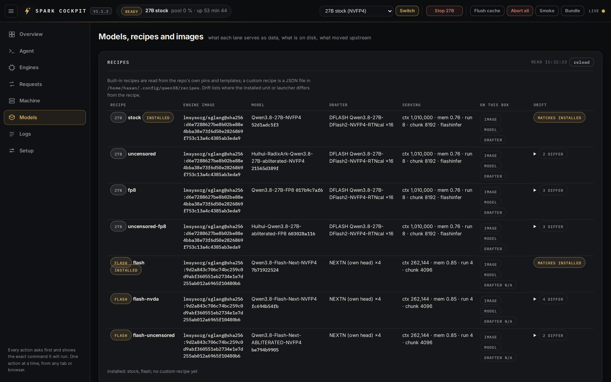
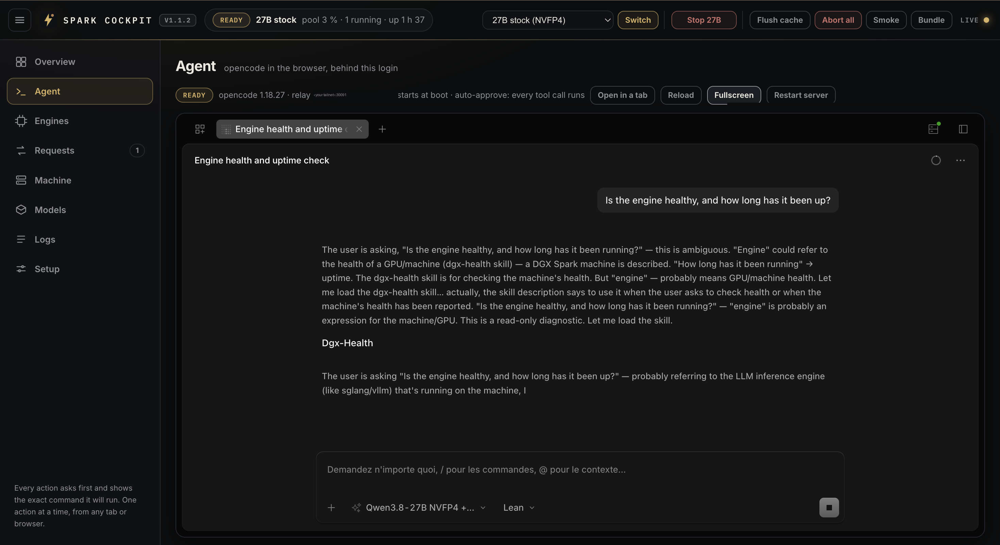
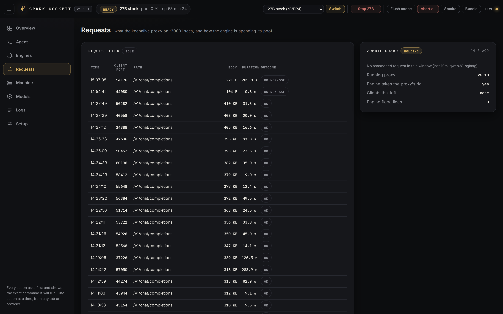

# The cockpit

The full tour. The README carries the short version: what the cockpit is, how it is installed, what it binds to, and the table of its tabs. This is everything else, starting with what it looks like.

## Installing it, and what it binds to

A local dashboard for this stack: what is served right now, whether it is
healthy for real, and the handful of actions you would otherwise type by hand.
Single-file stdlib backend, no pip and no venv. Since v1.12 `install.sh`
installs it as step 10/10, once the engine has answered a real generation, and
prints its URL as the last thing it says. You do not run anything else:

```bash
curl -fsSL https://raw.githubusercontent.com/hasso5703/dgx-spark-qwen38/main/get.sh | bash
# ... ends with:  ▶ OPEN THE COCKPIT:  http://<address>:30090
# the login is the API key from ~/.config/qwen38/api-key
```

On a first install it binds the box's **tailnet address** when there is one, so
the page opens from your laptop or your phone over a private network, and
`127.0.0.1` otherwise. A re-run never changes that: `install-dashboard.sh`
converges on the installed unit, so an upgrade cannot flip a reachable cockpit
back to loopback. Install it alone, or change the bind, with the same script:

```bash
dashboard/install-dashboard.sh          # DASH_PORT=30090 by default
```

To open a loopback-bound cockpit from another machine, set `DASH_BIND` and
re-run it:

```bash
DASH_BIND=0.0.0.0 dashboard/install-dashboard.sh        # every interface
DASH_BIND=$(tailscale ip -4) dashboard/install-dashboard.sh   # that interface only
```

Then browse `http://<the box's tailnet or LAN address>:30090`. The login is the
same API key, over plain HTTP: the session cookie is `HttpOnly` and
`SameSite=Strict` and every mutating POST carries a CSRF token, but there is no
TLS, so this belongs on a tailnet or a LAN you trust and never on the open
internet. On an already installed cockpit, change it in place:

```bash
sudo systemctl edit qwen38-dashboard    # [Service] Environment=COCKPIT_BIND=0.0.0.0
sudo systemctl restart qwen38-dashboard
```

## What it looks like


*Overview: what is served, on what pool, with how much memory left. The events on the right are the engine's own state transitions, including the kernel's GPU-allocation refusals that precede the memory edge on this hardware.*



*Models: the seven targets as data, derived from `install.sh` and the unit templates, each compared flag by flag against the invocation actually running. "2 DIFFER" is a recipe that would change something if you switched to it.*



*Agent: opencode's own web interface, framed behind this login, mid-answer on a real session. It starts at boot and its tool calls are already approved, so a laptop or a phone is enough to run a coding session on the box. The model picker at the bottom names what is answering: the 27B served by this same machine, at the `lean` effort level.*



*Requests: both sides of the wire. The feed is what the proxy relayed; the guard is whether any client walked away from an answer the engine is still generating.*

## What it does that a terminal does not

- **Lane state that is not a lie.** A wedged SGLang still answers `/health`, so
  the cockpit runs a real generation canary and reports `ready`, `loading`,
  `wedged` or `stopped` from that, with the served checkpoint named from the
  unit rather than guessed.
- **Belts.** A host `MemAvailable` floor that aborts generations before the box
  reaches the memory edge, and a counter of the kernel's `NVRM` allocation
  refusals, which is how the memory-edge behaviour in the flash section was
  found in the first place.
- **Actions, one at a time.** Unit start/stop/restart, lane switch (the same
  `switch-model.sh` you would run), cache flush, abort-all, smoke probe. Every
  action is audited to `~/.config/qwen38/cockpit-audit.log` with its exact argv.
- **Recipes and drift.** Every target as data, derived from `install.sh` and the lane
  templates so a recipe cannot drift from what the installer renders, compared flag by
  flag against the invocation actually running on the box. Since v1.8.5 that comparison
  covers value-less flags too (`switch.--sleep-on-idle: recipe true, installed false` is
  what the panel said the morning the flash lane was caught spinning a core).
- **Zombie guard.** A client that gives up leaves the engine decoding unless something
  stops it, so the Requests tab reads both sides of the wire: the engine's own flood
  lines grouped by request, worst first, with the span between a request's first and
  last line, which is the dead decode; what the proxy did about it over the same window
  (aborted, drained, the longest drain, aborts the engine never answered); the version
  of the **running** proxy from its startup banner; and whether the engine accepts the
  proxy's request id at all, because without that an abandoned answer can only be
  drained. See the v1.8.4 and v1.8.5 changelog entries.
- **Jobs.** Bench runs, the 4-canary quality battery, diagnostics bundles and cache
  operations run as supervised one-at-a-time jobs with live output, instead of
  commands you type blind into a terminal.
- **Housekeeping.** Inventory of everything the repo ever put on the box and
  what each item costs in bytes (read-only: the reclaim commands are printed by
  `./uninstall.sh --list` and by the installer, never run from the page), the
  opencode integration state (limits per lane, default model, output cap) with
  the one action that writes there, fitting those limits to the pool the engine
  actually booted with, the patched chat templates, the API key (masked,
  regenerable), and the repo itself (version, upstream tag, changelog, update
  badge).

On a phone the chrome collapses to one identity row plus a swipeable section
rail, controls are 44 px targets, and the Agent tab opens fullscreen (see "On a
phone" below): the whole box is operable from a hand.

**The privileged surface, stated plainly.** The unit actions need root, so the
installer writes `/etc/sudoers.d/qwen38-cockpit`: an exact argv allowlist,
nothing wildcarded except the rendered unit path, validated with `visudo -c`
from a temp file before it lands so a bad render can never brick sudo. It covers
start/stop/restart and enable/disable of this repo's units, `daemon-reload`, the
writes `switch-model.sh` performs, one read-only forensics wrapper and kernel
journal reads. `./uninstall.sh` removes it along with the unit and the wrapper.
If that surface is more than you want, do not install the cockpit: nothing else
in this repo depends on it.

**Self-restart is off by default** (`COCKPIT_AUTOHEAL=0` in the unit). This repo
spends a whole section on how a GB10 box freezes, so an engine that restarts
itself is not something an install should decide for you. Arm it once you know
what a wedge looks like on your box:

```bash
sudo systemctl edit qwen38-dashboard    # [Service] Environment=COCKPIT_AUTOHEAL=1
                                        # and Environment=COCKPIT_AUTOHEAL_GRACE=600
                                        # to keep a wedge up for forensics first
```

Remove it with `./uninstall.sh` (which takes the whole stack) or on its own:

```bash
sudo systemctl disable --now qwen38-dashboard
sudo rm -f /etc/systemd/system/qwen38-dashboard.service \
           /etc/sudoers.d/qwen38-cockpit /usr/local/bin/qwen38-pyspy-scheduler
sudo systemctl daemon-reload
```

## The System One tab: the typed-decisions endpoint, from a browser

`POST /v1/systemone` answers probabilities instead of text, and until this tab the only way
to see one was curl. The tab is the console for it, and it exercises the whole contract:

- **five prefilled examples**, one per shape the endpoint is actually used for: routing a
  support ticket, choosing an agent's next tool, moderating a comment, extracting a field,
  and an eight-option choice that pushes past the single-letter labels
- **an editor for all three question types**, with options and levels you can add and remove,
  so a question you are about to put in production can be tried before it is
- **the answer drawn as the distribution it is**: a bar per option, the pick and its
  confidence, and for a score the level the number lands on
- **the headers the contract has no room for**: how many branches the call fanned out to, how
  much of the model's first-token probability landed on a label, and how many tokens the
  radix cache served
- **the same call as a curl** that updates as you type and copies in one click, because the
  point of the tab is the request, not the tab
- **the measured comparison against the hosted Jev**, task by task, from BENCHMARKS.md

The serving key never reaches the page. The browser sends the state and the questions to the
cockpit, and the cockpit calls the proxy with the key it already holds; a test asserts that a
body naming its own path or upstream changes neither. Availability is probed rather than
assumed, so a box whose proxy predates v6.19 is told why instead of looking broken.

**Image** and **Video** are next to it and say Coming soon, which is the honest state of both.

## Being told there is a newer version

A box that runs an old release does not know it. The answer existed from v1.5 in the
Models tab, printed after a button press, which means it reached whoever already
suspected there was news. Since v1.15.2 the cockpit volunteers it: every six hours it
asks GitHub whether a newer release is published, and if there is one the banner strip
says so with the command that installs it. The Setup tab carries the same line
permanently, next to the repo's own version.

Two details decide whether this is useful or irritating. It compares version **numbers**,
not strings, so `v1.15.0` is correctly newer than `v1.9.0`, and it only speaks when the
published version is **strictly newer** than the installed one, because a box that
develops this repo is regularly ahead of the newest tag and would otherwise be nagged
forever. A box with no network says "latest release unknown" rather than raising an
alarm, and stops asking for a while instead of spending a request every collection.

The same strip carries the other staleness a running cockpit can have: a `git pull`
under a live process leaves it serving new HTML against the Python it imported at start,
so its controls and its checks disagree. The banner names the files that changed and the
one command that fixes it.

`COCKPIT_UPDATE_CHECK=0` turns the outbound check off. SECURITY.md names it as the one
request this stack makes that the operator did not type.

## On a phone

The cockpit is built for a hand as well as for a desk, and the layout is checked
rather than assumed: `dashboard/tests/mobile-check.mjs` drives a headless
Chromium through four real iPhone geometries (SE, 15, 15 Pro Max, and 15 in
landscape) on every tab and asserts what a phone actually gets.

Below 980 px the top bar keeps one identity row and gives the actions a row of
their own that scrolls sideways, the section rail becomes one swipeable row of
pills with the current section scrolled into view, and the cards stack. Controls
are at least 44x44 CSS px, and every form control is 16 px or larger, because
iOS Safari zooms the whole page when a smaller one takes focus and never zooms
back. The heights use `dvh`, not `vh`: on iOS the browser's own chrome counts
inside `100vh`, so a full-height panel written that way overflows by exactly the
toolbar.

The Agent tab opens **fullscreen on a phone**, because there the tab is the
frame: opencode gets the whole screen and the corner chip brings the cockpit
back. That choice is remembered per device, so exiting once makes the embedded
frame the default from then on. It never opens fullscreen when the panel cannot
load (a relay bound to another address, a stopped server): covering the
explanation with a blank frame would leave nothing to act on.

Run it against the address the phone uses, so the Agent tab is exercised the way
it behaves in a hand:

```bash
node dashboard/tests/mobile-check.mjs http://<the box's tailnet address>:30090
```

## The Agent tab: opencode in the browser, behind the cockpit login

Since v1.7.0 the cockpit can hold opencode's own web interface, so a session on the
box runs from the laptop without a terminal: sessions, the project picker, file
diffs, the terminal panel, the same config, plugins, skills and MCP servers as the
`oc` command. Since v1.12 `install.sh` installs it with the cockpit whenever
opencode 1.18 or newer is on your PATH; when it is not, the installer says so
and skips that one tab rather than failing an install that is otherwise up. Run
it by hand after installing opencode, or to retune it:

```bash
dashboard/install-agent.sh
```

Two pieces land, and the shape is the security model:

- **`opencode-web.service`** runs `opencode serve` as you on `127.0.0.1:4096`
  (`OPENCODE_PORT=`), with Basic credentials generated once into
  `~/.config/qwen38/opencode-web.env` (mode 0600). Nothing else ever reaches it,
  and the password never leaves the box. The unit carries your PATH and the same
  output-token cap as the `oc` launcher, so long thinking is not cut at 32,000.
- **The relay** inside the cockpit process listens on ONE address, the tailnet
  address by default (`AGENT_BIND=`, port `AGENT_PORT=30091`), never on the LAN.
  It answers a request only with a valid cockpit session cookie, refuses any
  foreign `Origin`, strips the cookie before forwarding, adds the credentials,
  and streams everything back: plain answers, the event stream, the WebSocket of
  the terminal panel. Its responses carry `frame-ancestors` naming the cockpit,
  so no other page can frame the interface.

The browser therefore sees one host for the cockpit and the relay (cookies ignore
ports): the Agent tab frames the interface with no second login and no Basic-auth
prompt, which Chrome would block inside a cross-origin frame anyway. That is also
the one rule: open the cockpit through the address the relay binds. With the
cockpit on `0.0.0.0` or on the tailnet address, that is
`http://<tailnet address>:30090/#agent`; the tab says so when you arrive by
another name. A cockpit bound to `127.0.0.1` gets a loopback relay, usable on the
box itself.

What the tab shows: the state of the server and the relay, the served opencode
version and, after `opencode upgrade`, that a newer binary is installed with a
**Restart server** button (systemd restart, through the same exact-argv sudoers
allowlist as the other units, three more lines). **Fullscreen** makes the
interface cover the whole browser window; the corner button or Escape brings the
cockpit back, and a reload on the tab comes back the way it was left. Prefer it
to opening more browser tabs: every tab of the interface holds one permanent
event stream, browsers allow six connections per origin, and a sixth tab freezes
them all (the interface handles any number of sessions in one tab). **Open in a
tab** still exists for a second screen. The Logs tab reads the server's journal.

Permissions are opencode's own. Its defaults (opencode 1.18) allow most tool
calls and ask before a tool touches a path outside the session's project and
when the same call repeats three times; the interface shows those prompts. For
the autonomy of the `oc` launcher's `--yolo` (a flag `opencode serve` rejects),
install with `AGENT_AUTO=1`: the unit then carries `OPENCODE_PERMISSION` set to
allow everything, which opencode honours (verified: the served config reads
`{"*": "allow"}`), explicit `deny` rules of your config still apply, and your
`opencode.json` is not touched. The tab says which mode the running server
applies. Re-runs remember the choice; `AGENT_AUTO=0` turns it back off.

```bash
AGENT_AUTO=1 dashboard/install-agent.sh
```

Variables: `OPENCODE_PORT` (4096), `AGENT_PORT` (30091), `AGENT_BIND` (an address,
or `tailscale`), `AGENT_AUTO` (0 or 1), `AGENT_OUTPUT_TOKEN_MAX` (the output
ceiling; by default `./oc-limits.sh --max-out`, the largest limit any target asks for), `AGENT_PATH` (the PATH the service gets; yours by
default). Re-running
`dashboard/install-dashboard.sh` alone keeps the relay settings, the bind and the
port it finds in the installed unit. Remove with:

```bash
sudo systemctl disable --now opencode-web.service
sudo rm -f /etc/systemd/system/opencode-web.service
DASH_AGENT_PORT=0 dashboard/install-dashboard.sh       # the cockpit without the relay
```

[Back to the README](../README.md)
